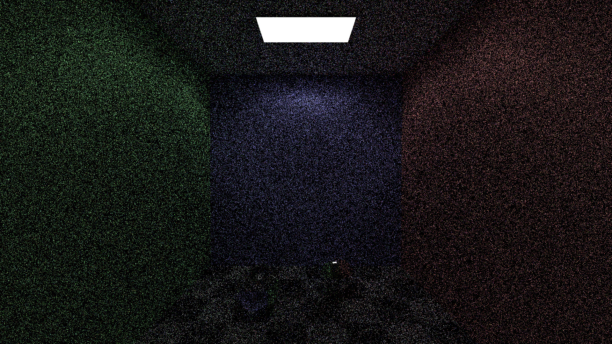
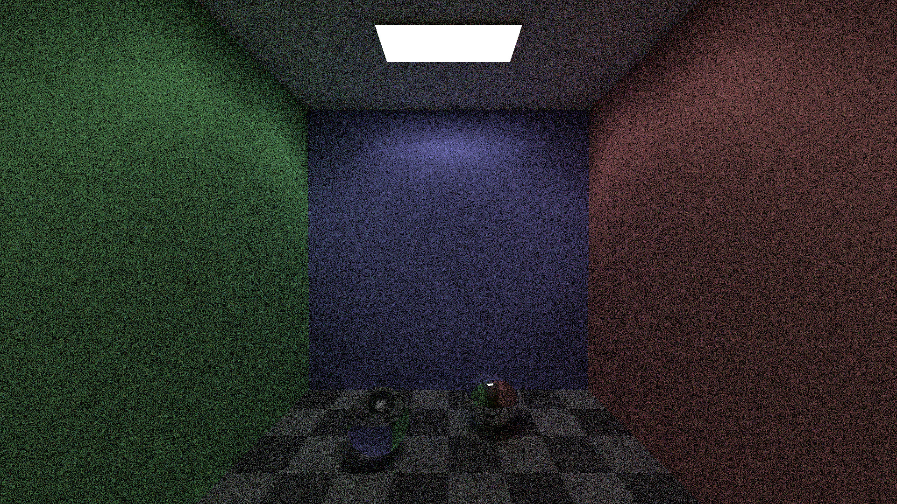
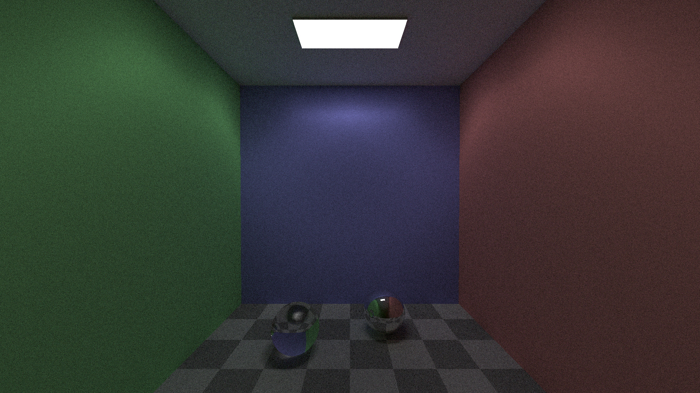
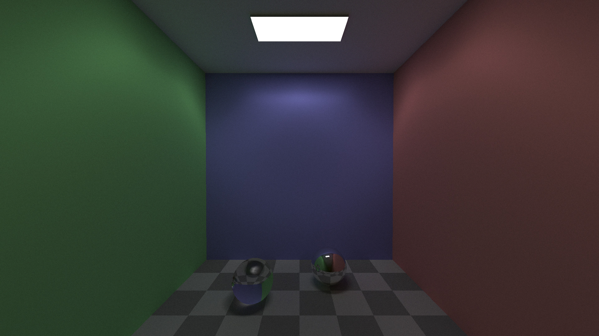
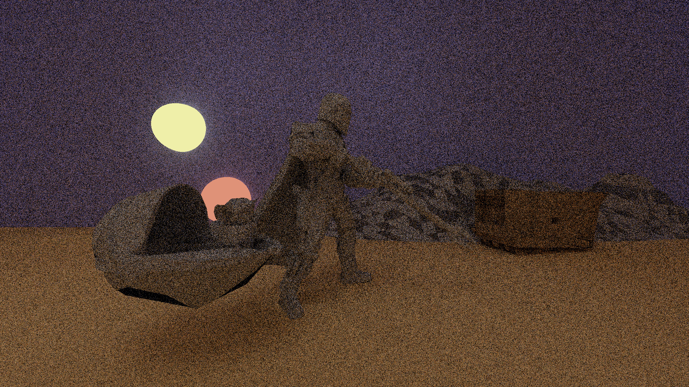
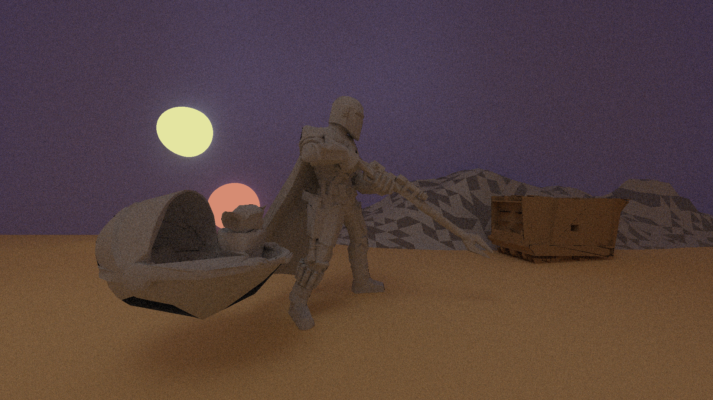

# Monte Carlo Ray Tracing Engine Built in C++

An engine built to render complex scenes with all the capabilities of real world private engines. Images are outputted in the PPM format and use a simple driver file system for creation.

## For Ben and Wen

The Two Drivers that I am submitting are Spheres and Mando. Spheres is the simpler of the scenes, I have found that running it with a sample size of 100 results in a reasonable run time of about 5 minutes. The second driver file is actually amazing, but it is incredibly complex to render. I have provided a version titled QuickMando for testing purposes. Running QuickMando with a sample size of 100 results in a run time of about 2 hours. If you run it with 10 samples the image will have significant degredation but will still produce a semi-accurate image with at a reasonable speed. QuickMando has a resolution of 240x135. The regular Mando file is identical but its resolution has been brought up to 1920x1080. I have probed this driver with what limited time I have and have found it to produce images with 100 samples in around a week. The resulting images folders contain the images that are created at various resolutions. I am running the Mando driver file at higher resolutions currently and they will be completed by the end of winter break. If Ross wants the image for his wall, I can provide it to him them. I plan on implementing the bounding box hierarchy at some point over the break, but it didn't make it for this release. It has been fun learning from you and I am sure I will see you around as I am taking 510 next semester. Have a great break!

## Features

The engine uses a Monte Carlo technique to render images. This process randomly fires rays on contact with Lambertian materials. This creates much more accurate lighting than traditional Ray Tracing. The downside is of course speed. The engine can handle simple Lambertian surfaces, metal surfaces with total reflection, and refractive surfaces such as glass. The engine also produces accurate shadows and highlights and has complex material control.

## Tech/framework used

Built with:  

[C++](http://www.cplusplus.com/)   
[CMake](https://cmake.org/)  
[Open MP](https://www.openmp.org/)  

## Example Images

Shown below are the resulting images when running the engine with the driver "Spheres".

| Number of Samples | Resulting Image |
| ----------------- | --------------- |
| 10 Samples |  |
| 100 Samples |  |
| 1000 Samples |  |
| 10000 Samples |  |

Shown below are the resulting images when running the engine with the driver "Mando".

| Number of Samples | Resulting Image |
| ----------------- | --------------- |
| 10 Samples |  |
| 100 Samples |  |
| 1000 Samples |  |


## Installation

### Building the Executable

After downloading the repository, navigate to the directory where the repository is stored.

From the Command Line, Enter The Command

``` bash
cmake . && make
```

### Running the Engine:

After You Have Built the Executable, Run The Program Using the Command 

``` bash
./raytracer [Driver File] [Ouput File] [Samples]
```

The output format for the image is the PPM model. You can open such images in most image viewers and applications such as Adobe Photoshop. The number of Samples directly coresponds to the amount of noise in the image. The higher the samples, the higher quality of an image.

### Creating Driver Files

For your convenience, example driver files have been provided under the folder titled ExampleDriverFiles. These driver
files are all fully featured to create interesting and dramatic images that showcase the features of the engine.

If you wish to create your own driver files, the following fields are required for each element:

eye X Y Z  
look X Y Z  
up X Y Z  
d Distance  
bounds Left Right Bottom Top  
res Width Height  
sphere X Y Z Radius AlbedoRed AlbedoGreen AlbedoBlue  
model RX RY RZ RTheta ScaleFactor TX TY TZ SmoothingTheta FilePath

For Spheres and for Model Material Files, optional fields exist. Appending "light", "mirror", or "glass" to the end of a sphere line or material description will activate the corresponding property for that section of the image. See reference driver files for examples. Make sure that the bounds and resolution share an aspect ratio. This is important to ensure no artifacts.

## Where to Find OBJ Files

Finding obj files is inconsequential. Simply look up ".obj files" on the internet and choose one that fits your liking.
Make sure that you create the proper material file using the format showcases in the example files. Files with Triangle counts of over 10K will result in images that take a significant time to render.

### Created by Max Rosoff with the advice of Ben Sattelberg and Ross Beveridge
